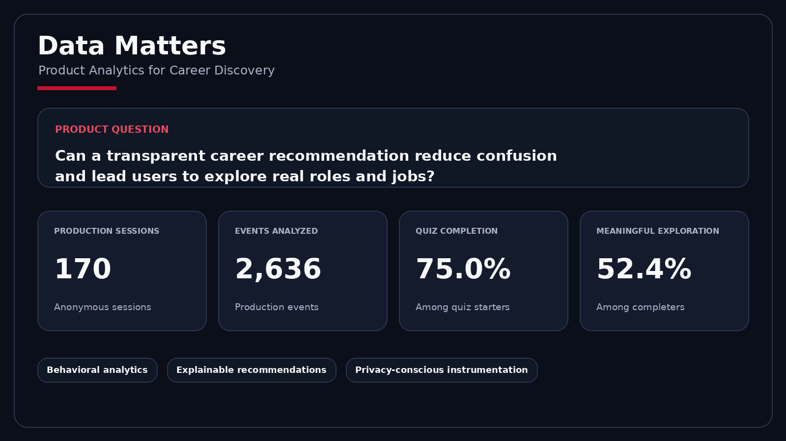
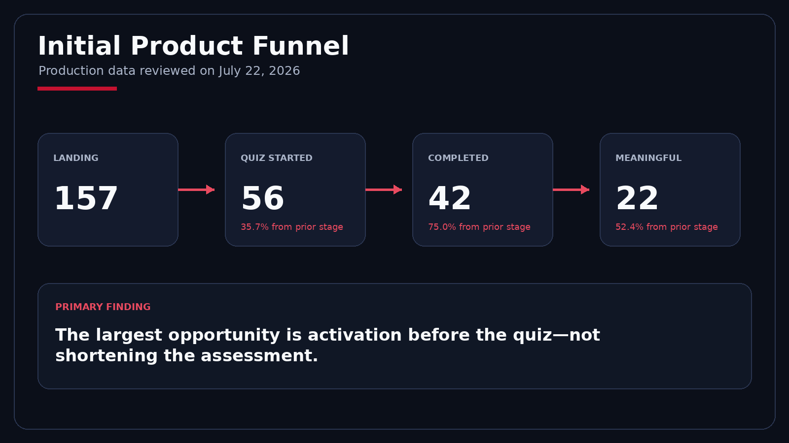
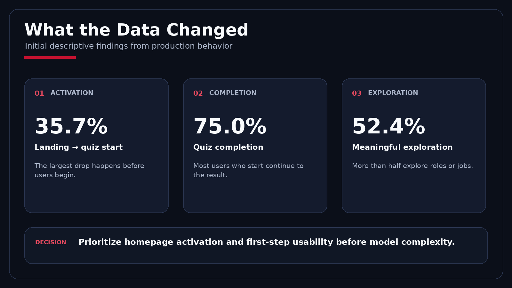
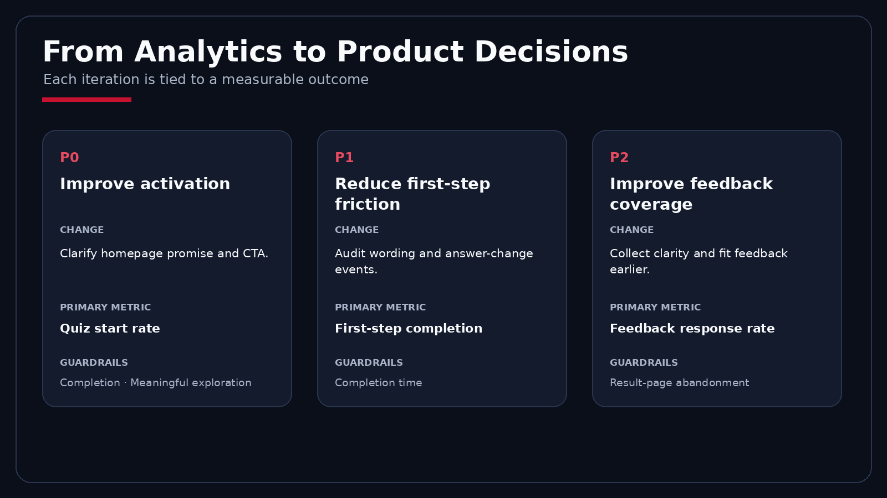
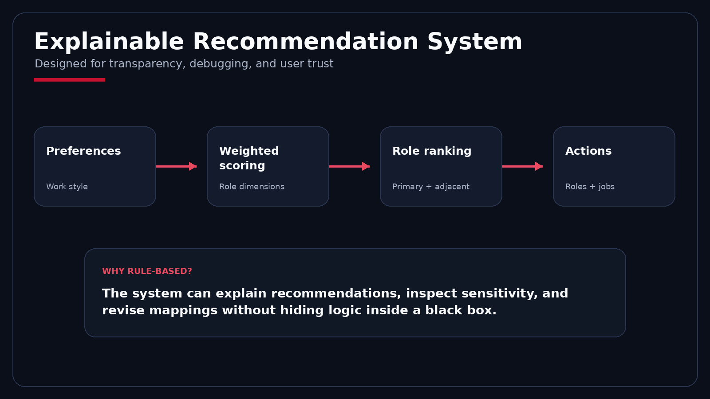
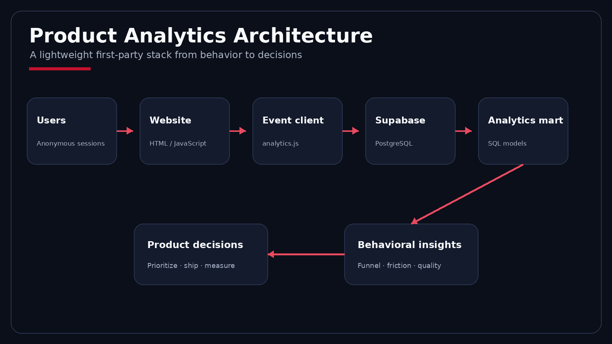

# Data Matters
## Product Analytics for Career Discovery

[Live Product](https://datamatters-hanks-career-board.netlify.app/) · [中文使用說明](README.zh-TW.md) · [Product DS Technical Notes](docs/PRODUCT_DS_TECHNICAL_NOTES.md) · [Analysis Roadmap](docs/PRODUCT_DS_ROADMAP.md)

<p align="center">
  
</p>

**Data Matters** is a mobile-first career exploration product and Product Data Science case study for students who know they are interested in data but cannot yet distinguish adjacent career paths.

The product combines:

- a transparent role-recommendation system;
- real role, skill, industry, and job examples;
- privacy-conscious first-party behavioral analytics;
- funnel and question-friction analysis;
- recommendation-quality measurement;
- experimentation and product-iteration planning.

The central question is not only whether the product can generate a recommendation. It is whether the recommendation helps users understand the field and take a meaningful next step.

> **Current status:** The product and analytics instrumentation are live. Findings below are descriptive results from the initial production sample and should not be interpreted as causal impact estimates.

---

## Product problem

Students often encounter broad labels such as *data analyst*, *data scientist*, *data engineer*, and *product analyst* without understanding:

1. what each role actually does;
2. which work style fits them;
3. how adjacent roles differ;
4. what role, skill, or job they should explore next.

Most career quizzes stop after presenting a label. Data Matters instead starts from **work preferences** and connects the result to explanations, adjacent role families, skills, industries, and concrete job examples.

### Target users

- University students exploring data careers
- Early-career professionals considering a transition
- Users who “like data” but cannot distinguish adjacent roles

### Job to be done

> Help me quickly understand which data roles are worth exploring, why they may fit me, and what concrete action I should take next.

---

## Product experience

The experience follows a simple sequence:

**landing → preference assessment → primary recommendation → explanation → adjacent roles → real jobs → next action**

The result page is structured as:

**identity → explanation → real work → alternatives → profile → jobs → next action**

This keeps the first screen simple while allowing users to inspect deeper reasoning when needed.

---

## Initial production funnel

<p align="center">
  
</p>

Initial production review:

| Metric | Result |
|---|---:|
| Anonymous sessions | 170 |
| Production events | 2,636 |
| Landing sessions | 157 |
| Quiz started | 56 |
| Quiz completed | 42 |
| Meaningful exploration sessions | 22 |
| Landing → quiz start | 35.7% |
| Quiz start → completion | 75.0% |
| Completion → meaningful exploration | 52.4% |
| Median quiz completion time | 153 seconds |

The largest observed drop occurs **before the assessment begins**. Once users start, most complete the quiz and reach a recommendation.

This shifted the initial product priority away from shortening the entire quiz and toward improving homepage activation and first-step usability.

---

## Product insights

<p align="center">
  
</p>

### 1. Activation is the primary opportunity

Only **35.7%** of landing sessions started the assessment.

The homepage must communicate the value, expected effort, and output more clearly before additional recommendation complexity is added.

### 2. The quiz itself is not the largest bottleneck

Among users who started, **75.0%** completed the assessment.

Step-one completion was materially lower than completion among users who had already passed the first step, suggesting that early comprehension and commitment deserve more attention than total quiz length.

### 3. Recommendations lead to additional exploration

Among completed sessions, **52.4%** performed at least one meaningful exploration action.

This indicates that the product can move users beyond receiving a label and into deeper role or job exploration.

### 4. Feedback coverage is still insufficient

Only a small number of users submitted post-result clarity or recommendation-fit feedback.

Recommendation accuracy and clarity uplift therefore cannot yet be reported reliably. Increasing feedback coverage is a higher priority than optimizing scoring weights from insufficient evidence.

---

## Product decisions

<p align="center">
  
</p>

| Priority | Product change | Primary metric | Guardrails |
|---|---|---|---|
| P0 | Clarify homepage promise and CTA | Quiz-start rate | Completion and meaningful exploration |
| P1 | Audit first-step wording and interaction behavior | First-step completion | Completion time and later-step completion |
| P2 | Collect clarity and fit feedback earlier | Feedback response rate | Result-page abandonment |
| P3 | Improve post-result role and job exploration | Meaningful exploration rate | User confusion and external-click quality |

A proposed homepage experiment:

- **Control:** existing CTA
- **Treatment:** a clearer value-and-effort message such as “Find your data-career direction in three minutes”
- **Primary metric:** quiz-start rate
- **Guardrails:** quiz-completion rate, meaningful-exploration rate, and completion time

---

## North-star metric

### Meaningful Career Exploration Rate

A completed session is considered meaningful when the user performs at least one high-intent action after receiving a result, such as:

- opening a recommended role;
- exploring an adjacent role;
- comparing roles;
- opening a job example;
- visiting an external job source.

Sharing behavior should be analyzed separately as **viral engagement**, rather than treated as equivalent to core career exploration.

### Supporting metric groups

**Acquisition**
- Landing sessions
- Source and campaign mix
- Shared-result referrals

**Activation**
- Quiz-start rate
- Baseline-clarity completion
- First-step completion

**Engagement**
- Quiz completion
- Completion time
- Question response time
- Answer changes
- Adjacent-role exploration
- Role comparison

**Outcome**
- Meaningful exploration
- Clarity uplift
- Recommendation-fit rating
- Job exploration
- External-job click-through

**Guardrails**
- Missing or duplicated events
- Device-level completion differences
- Very fast completion
- Low-confidence recommendations
- Result dissatisfaction

---

## Recommendation system

<p align="center">
  
</p>

Data Matters uses an interpretable, rule-based recommendation approach.

User responses represent preferences including:

- coding and algorithmic effort;
- ambiguity tolerance;
- deep-focus preference;
- stakeholder interaction;
- stable delivery versus open-ended problem solving;
- preferred outputs and decisions;
- ownership and execution style.

Responses are mapped to weighted role-family dimensions. The product returns:

- a primary recommendation;
- adjacent alternatives;
- human-readable reasons;
- relevant role descriptions;
- skills, industries, and job examples.

### Why an interpretable system?

At this stage, interpretability is more valuable than model complexity.

It allows the product to:

- explain why a role was recommended;
- debug unexpected results;
- inspect sensitivity to individual answers;
- revise mappings without retraining a black-box model;
- validate role definitions with practitioners and target users.

The result is a decision-support heuristic, not a psychological assessment or hiring evaluation.

---

## Product analytics architecture

<p align="center">
  
</p>

The product uses first-party event tracking through Supabase.

### Measurement questions

The instrumentation is designed to answer:

- Where do users abandon the experience?
- Which questions take the longest?
- How often do users change answers?
- Which recommendations lead to role or job exploration?
- Do users compare adjacent roles?
- Does career clarity improve after the result?
- How accurately do users feel the recommendation represents them?
- Do shared results generate qualified new sessions?

### Privacy principles

- Anonymous, session-level identifiers
- No login requirement
- No browser fingerprinting
- Referrer stored only as a domain
- Event and property allowlists
- No raw quiz-answer object or DOM capture
- Analytics failures do not block product usage
- Database access controlled through Supabase Row Level Security

---

## Instrumentation notes

The initial analytics review also identified areas requiring instrumentation validation.

### Answer-change events

High answer-change rates may represent real reconsideration, but they may also be inflated by event semantics or interface behavior. Raw event sequences should be audited before treating answer changes as evidence of question confusion.

### Job events

`result_job_card_clicked`, `job_opened`, and `external_job_clicked` currently show identical counts in the initial dataset. Their timestamps and firing logic should be reviewed to ensure they represent separate funnel stages rather than three events emitted by one click.

### Final-answer distribution

Question-option analysis should use the last recorded answer for each session and question. Counting every selected option can misrepresent the final preference distribution when users revise answers.

These checks are documented because trustworthy instrumentation is part of the Product Data Science work—not an implementation detail to hide.

---

## Technical stack

| Layer | Technology |
|---|---|
| Front end | HTML, CSS, vanilla JavaScript |
| Product logic | Interpretable weighted scoring |
| Analytics client | First-party JavaScript instrumentation |
| Data platform | Supabase / PostgreSQL |
| Analysis | SQL analytics mart and notebook workflow |
| Deployment | Netlify |
| Validation | Linting, data checks, product tests, analytics tests, build validation |

### Local development

Requirements:

- Node.js 22 or later

```bash
npm install
npm run dev
```

### Validation

```bash
npm run validate
```

The validation command runs linting, data validation, automated tests, and a production build.

---

## Repository structure

```text
.
├── index.html
├── app.js
├── product-v3.js
├── analytics.js
├── analytics-config.js
├── analysis/
│   ├── README.md
│   ├── RESULTS.md
│   ├── METRIC_DEFINITIONS.md
│   ├── sql/
│   └── notebooks/
├── data/
├── docs/
│   ├── images/
│   ├── PRODUCT_DS_TECHNICAL_NOTES.md
│   └── PRODUCT_DS_ROADMAP.md
├── images/
├── scripts/
├── supabase/
├── tests/
├── netlify/
└── package.json
```

Key files:

- `app.js` — core product state, assessment, scoring, role and job behavior
- `product-v3.js` — result experience, comparison, and sharing behavior
- `analytics.js` — anonymous event collection and payload controls
- `analysis/` — Product DS metric definitions, SQL analysis, results, and notebooks
- `supabase/` — database definitions and analytics infrastructure
- `tests/` — product and analytics validation

---

## Validation strategy

### Technical validity

- Scoring produces valid rankings
- All role families remain reachable
- Event schemas match the database
- Duplicate and malformed events are controlled
- Mobile and desktop flows behave consistently

### Recommendation validity

- Role mappings are reviewed by practitioners
- Representative profiles produce expected rankings
- Small answer changes do not create unreasonable rank reversals
- Perceived fit is analyzed by recommended role and confidence level

### Product validity

- Users understand the recommendation
- Users can distinguish adjacent roles
- Career clarity improves
- Users take a relevant next action

---

## Current limitations

- Scoring weights are expert-defined rather than learned from labeled outcomes.
- Self-reported clarity and recommendation fit are subjective.
- A completed quiz does not prove that a career decision improved.
- The initial sample supports descriptive analysis, not causal conclusions.
- External-job clicks measure interest rather than applications or career outcomes.
- Anonymous sessions limit longitudinal retention analysis.
- Role and job taxonomies require periodic review.
- Feedback coverage is currently too small for recommendation-calibration claims.

These limitations are documented intentionally. The objective is to demonstrate responsible product reasoning, not overstate precision.

---

## Next milestones

1. Improve homepage activation through a focused experiment.
2. Audit first-step questions and answer-change instrumentation.
3. Separate job-card, job-detail, and external-click events.
4. Increase post-result clarity and fit feedback coverage.
5. Validate role mappings with practitioners and target users.
6. Add recommendation stability and counterfactual explanation analysis.
7. Publish refreshed aggregate findings after a larger production sample.

See [Product DS Technical Notes](docs/PRODUCT_DS_TECHNICAL_NOTES.md) and [Analysis Roadmap](docs/PRODUCT_DS_ROADMAP.md) for the detailed methodology.

---

## Why this project

Most portfolio recommendation projects end when a model returns a label.

Data Matters treats the recommendation as the beginning of a product journey.

The project demonstrates how Product Data Science can connect:

- an ambiguous user problem;
- an interpretable recommendation system;
- behavioral event design;
- data-quality validation;
- funnel and diagnostic analysis;
- measurable product decisions;
- experimentation under low traffic;
- privacy-conscious analytics.

The goal is not to build the most complex recommendation model. It is to determine whether the product helps users understand their options and take a better next step.

---

## Disclaimer

Data Matters is an educational exploration tool. It does not provide psychological assessment, hiring evaluation, or guaranteed career advice. Recommendations should be combined with job research, project experience, coursework, and conversations with practitioners.
