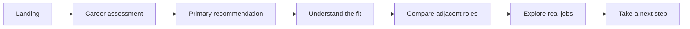
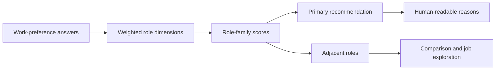
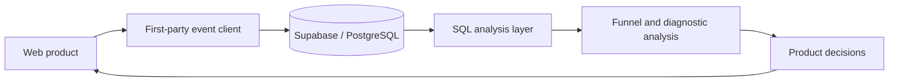

# Data Matters

### A product analytics case study for career discovery

[**Try the live product →**](https://datamatters-hanks-career-board.netlify.app/)  
[中文使用說明](README.zh-TW.md) · [Technical Notes](docs/PRODUCT_DS_TECHNICAL_NOTES.md) · [Analysis Roadmap](docs/PRODUCT_DS_ROADMAP.md)

<p align="center">
  
</p>

Data Matters helps students who are interested in data careers but cannot yet distinguish roles such as Product Analytics, Data Science, Business Intelligence, Data Engineering, and Decision Science.

I built it as an end-to-end **Product Data Science case study**: framing the user problem, designing an interpretable recommendation system, instrumenting the product journey, analyzing production behavior, and translating findings into product priorities.

> **Product question:** Can a transparent career recommendation reduce decision anxiety and lead users to explore relevant roles and jobs?

---

## What I built

The product guides users through a short preference assessment and turns their answers into:

- one primary career direction;
- adjacent roles worth comparing;
- an explanation of why the result fits;
- real responsibilities, skills, industries, and job examples;
- a clear next step after the recommendation.

<p align="center">
  
</p>

### Product journey



The product intentionally starts from **preferred ways of working**, rather than asking users to choose among job titles they may not understand.

---

## Initial production results

<p align="center">
  
</p>

| Metric | Initial result |
|---|---:|
| Anonymous sessions | 170 |
| Production events | 2,636 |
| Landing sessions | 157 |
| Quiz started | 56 |
| Quiz completed | 42 |
| Meaningful exploration sessions | 22 |
| Landing → quiz start | 35.7% |
| Quiz start → completion | 75.0% |
| Completion → meaningful exploration | 52.4% |
| Median quiz completion time | 153 sec |

These figures are descriptive results from the initial production sample, not causal impact estimates.

### What the data changed

**1. Activation—not quiz length—is the largest opportunity.**  
The largest observed drop occurs between landing and quiz start. Once users begin, 75% complete the assessment.

**2. The recommendation is functioning as a gateway, not merely an endpoint.**  
More than half of completed sessions continue into a role, comparison, or job-exploration action.

**3. Feedback collection is not yet strong enough to claim recommendation accuracy.**  
The next priority is improving clarity and fit-response coverage before tuning recommendation weights from sparse evidence.

### Product priorities

| Priority | Product action | Primary metric | Guardrail |
|---|---|---|---|
| P0 | Clarify the homepage value proposition and CTA | Quiz-start rate | Completion and exploration |
| P1 | Reduce friction in the first assessment step | First-step completion | Completion time |
| P2 | Collect clarity and recommendation-fit feedback earlier | Feedback response rate | Result-page abandonment |
| P3 | Strengthen post-result role and job exploration | Meaningful exploration rate | Low-quality clicks |

---

## Measurement strategy

### North-star metric

**Meaningful Career Exploration Rate**

A completed session is counted as meaningful when the user performs at least one high-intent action after receiving a result:

- opens a recommended or adjacent role;
- compares roles;
- opens a job example;
- visits an external job source.

Result sharing is tracked separately as a distribution metric rather than counted as equivalent to career exploration.

### Metric tree

| Stage | Metrics |
|---|---|
| Acquisition | Landing sessions, source mix, shared-result referrals |
| Activation | Quiz-start rate, baseline-clarity completion, first-step completion |
| Engagement | Quiz completion, response time, answer changes, role comparison |
| Outcome | Meaningful exploration, clarity uplift, perceived fit, external-job clicks |
| Guardrails | Missing events, duplicate events, device gaps, abnormal completion time |

---

## Recommendation system

Data Matters uses a rule-based, interpretable scoring system.



The inputs represent preferences such as:

- coding and algorithmic effort;
- ambiguity tolerance;
- deep-focus work;
- stakeholder interaction;
- stable execution versus open-ended problem solving;
- preferred outputs and decisions.

### Why not a black-box model?

At this stage, interpretability is more valuable than predictive complexity. It enables:

- transparent explanations for users;
- debugging of unexpected results;
- sensitivity analysis under small answer changes;
- practitioner review of role mappings;
- fast iteration without hidden model behavior.

The recommendation is a career-exploration heuristic—not a psychological test, hiring assessment, or guarantee of fit.

---

## Product analytics architecture



The product tracks the journey from landing to recommendation and post-result exploration through anonymous, first-party events.

### Measurement questions

The instrumentation is designed to answer:

- Where do users abandon the experience?
- Which questions create the most friction?
- How often do users revise answers?
- Which recommendations lead to deeper exploration?
- Do users compare adjacent roles?
- Do users leave with more clarity?
- Which changes should be prioritized next?

### Privacy principles

- anonymous session identifiers;
- no login requirement;
- no browser fingerprinting;
- referrer stored only as a domain;
- event and property allowlists;
- no DOM or raw-answer-object capture;
- analytics failures do not block product use;
- Supabase Row Level Security.

---

## Instrumentation findings

Instrumentation quality is treated as part of the Product DS work.

### Answer-change events

High answer-change rates may reflect real reconsideration, interface behavior, or event semantics. Raw sequences should be audited before interpreting them as question confusion.

### Job-click events

Job-card, job-detail, and external-click events should represent distinct funnel stages. Identical counts or timestamps require validation before conversion rates are reported.

### Final-answer analysis

Question-level preference distributions should use the final answer per session and question. Counting every selection can overstate options that users later changed.

---

## Technical implementation

| Layer | Technology |
|---|---|
| Front end | HTML, CSS, vanilla JavaScript |
| Product logic | Interpretable weighted scoring |
| Analytics | First-party JavaScript event instrumentation |
| Data platform | Supabase / PostgreSQL |
| Deployment | Netlify |
| Quality | Data validation, analytics tests, product tests, build checks |

### Local development

Requires Node.js 22 or later.

```bash
npm install
npm run dev
```

### Validation

```bash
npm run validate
```

---

## Repository map

```text
.
├── index.html                 # Main product shell
├── app.js                     # Assessment, state, scoring, role/job behavior
├── product-v3.js              # Result experience, comparison, sharing
├── analytics.js               # Anonymous event collection
├── analytics-events.js        # Event definitions
├── analysis/                  # SQL, notebooks, results, metric definitions
├── data/                      # Role, skill, industry, and job content
├── docs/                      # Technical notes and roadmap
├── supabase/                  # Database and analytics infrastructure
├── tests/                     # Product and instrumentation tests
└── netlify/                   # Deployment functions
```

---

## Validation framework

### Technical validity

- scoring returns valid and reachable role rankings;
- event schemas match the database;
- duplicate and malformed events are controlled;
- core flows work across mobile and desktop.

### Recommendation validity

- representative profiles produce plausible rankings;
- mappings are reviewed with practitioners;
- small answer changes do not create unreasonable rank reversals;
- perceived fit is analyzed by role and confidence state.

### Product validity

- users understand the result;
- users can distinguish adjacent roles;
- self-reported clarity improves;
- users take a relevant next action.

---

## Current limitations

- Recommendation weights are expert-defined rather than learned from labeled career outcomes.
- Clarity and perceived fit are self-reported.
- Quiz completion does not prove that a career decision improved.
- The initial production sample supports descriptive analysis, not causal claims.
- External-job clicks measure interest, not applications or career outcomes.
- Anonymous sessions limit longitudinal analysis.
- Feedback coverage is currently insufficient for recommendation-calibration claims.

---

## Next steps

1. Test a clearer homepage value proposition and CTA.
2. Audit first-step wording and answer-change instrumentation.
3. Separate job-card, job-detail, and outbound-click measurement.
4. Improve post-result clarity and fit-feedback coverage.
5. Validate recommendation mappings with target users and practitioners.
6. Add recommendation stability and counterfactual explanations.
7. Publish refreshed aggregate results after a larger production sample.

Detailed methods are available in:

- [Product DS Technical Notes](docs/PRODUCT_DS_TECHNICAL_NOTES.md)
- [Product DS Analysis Roadmap](docs/PRODUCT_DS_ROADMAP.md)

---

## Why this project

Most recommendation portfolio projects end when an algorithm returns a label.

Data Matters treats the recommendation as the beginning of a measurable product journey. The project connects:

- an ambiguous user problem;
- an interpretable recommendation system;
- behavioral event design;
- instrumentation validation;
- funnel and diagnostic analysis;
- product prioritization;
- experimentation under limited traffic;
- privacy-conscious analytics.

The objective is not to build the most complicated model. It is to determine whether the product helps users understand their options and take a better next step.

---

## Disclaimer

Data Matters is an educational exploration tool. It does not provide psychological assessment, hiring evaluation, or guaranteed career advice. Results should be combined with job research, project experience, coursework, and conversations with practitioners.
